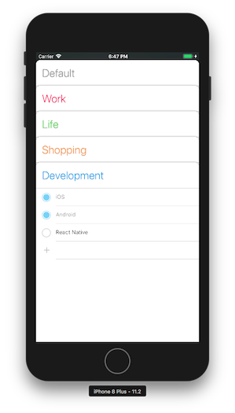
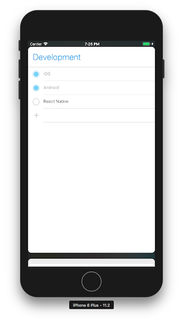
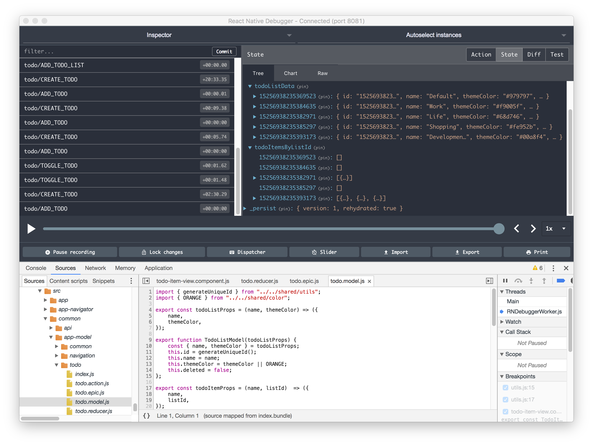
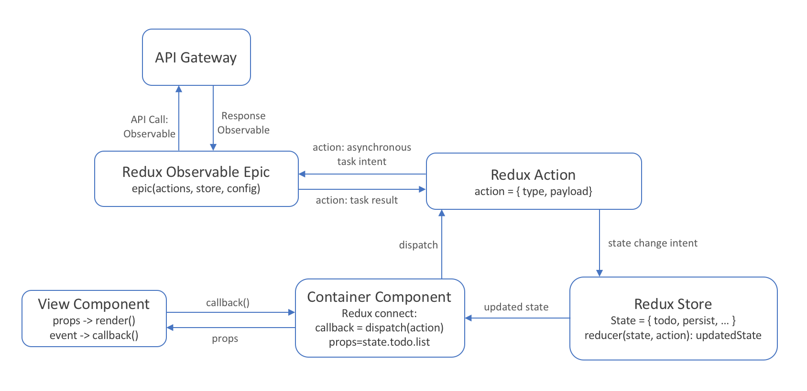

# PlanA
This is a ReactNative Todo App with Redux.

## Screenshot

  

## Tools

This project uses libraries and tools below:
- ES6 syntax and [Babel](https://babeljs.io)
- [React Native](https://facebook.github.io/react-native) for the iOS & Android Apps
- [Redux](http://redux.js.org) to organize the data flow management
- [Redux Observable](https://redux-observable.js.org) for the Redux Middleware
- [RxJS](http://reactivex.io/rxjs/) for asynchronous event handling
- [React-Navigation](https://reactnavigation.org/) for App Navigation


## Install and Run

```sh
$ git clone git@github.com:7estal/PlanA.git
$ cd PlanA
$ yarn install or npm install
$ react-native run-ios or react-native run-android
```


## Debug

For debugging the standalone app [React Native Debugger](https://github.com/jhen0409/react-native-debugger) is recommended. It already includes [React DevTools](https://github.com/facebook/react-devtools) and [Redux DevTools](https://github.com/gaearon/redux-devtools).

Screenshot of the React Native Debugger below shows the state tree of the Todo App.

 

## Architecture and Data Flow

The App is structured with React Redux. 



In React Redux, we have two kinds of component, presentational component and container component.

- Presentational component is responsible for the UI presentation and should not contains business logic
- Container component, on the oppisite, organize and define the data and behavior for the presenter to use

When user performed some change, the component will dispatch an action. Depends on the action type, 

- If it's a state change intent, for example toggle a todo status, we could handle it directly in the store reducer to perform the change in the state.
- If it's some event that we would like to handle asynchronously, for example an API call, we could subcribe it in the epic. After we get the response, we could send out another state change action as we do in the former case.

When the state is updated, React will rerender the component with the new props.

##Project File Structure

```
index.js	(Entry file)
src/
├── api/	(API Services)
├── app/	(APP Component and Initialization)
├── app-model/		
	├── common/
	├── navigation/
	├── todo/
		├── todo.action.js		(Actions Definition)
		├── todo.epic.js		(Redux Observable Epics)
		├── todo.model.js		(Todo Models)
		├── todo.reducer.js		(State Tree Todo Slice Definition)
├── home-screen/
	├── home-screen.component.js			(Home Screen Presentational Component)
	├── home-screen.container.component.js	 (Home Screen Container Component)
├── ui/
	├── app-navigator	(Use React-Navigation for App Navigation)
	├── component		(UI Components)
└── shared/		(Shared Modules and Utils)
```

## Data Structure

There are two main data structure in the App which are the `TodoListModel` and `TodoItemModel` (definition in todo.modol.js).

The `TodoListModel` includes the basic infomation of a Todo List such as ID, list name, theme color and so on.

```javascript
export function TodoListModel(todoListProps) {
    const { name, themeColor } = todoListProps;
    this.id = generateUniqueId();
    this.name = name;
    this.themeColor = themeColor || ORANGE;
    this.deleted = false;
};
```

In the `TodoItemModel` every Todo Item includes the listId it belongs to, and its itemId in the list. The ``${listId}#${itemIndex}` becomes the unique id of the Todo Item.

```javascript
const TODO_ID_SEPARATOR = '#';

export function TodoItemModel(todoProps) {
    const { name, listId, itemIndex } = todoProps;
    this.id = `${listId}${TODO_ID_SEPARATOR}${itemIndex}`;
    this.name = name;
    this.listId = listId;
    this.itemIndex = itemIndex;
    this.completed = false;
};
```

Next, we need to organize the `TodoListModel` and `TodoItemModel` data in the state tree in a way that is easy to query, and also easy to sync with the backend in the feature.

Therefore, we have two sub slice in the todo state slice. 

- The `todoListData` stores all the data of the `TodoListModel`, this state will only change when user created a new TodoList.
- The `todoItemsByListId` stores the `TodoItemModel` by their `listId`. When user would like to change a Todo, we need to find the `TodoItemModel` quickly in the state tree. Therefore we set the `listId` as a kind of index of the TodoItem, and make the `todoItemsByListId` as a Map inwhich the `listId` are the keys instead of as a Array.

```json
{
    todo: {
        todoListData: {
            [listId-1]: {
                id: listId-1,
                name: listName,
                themeColor: color,
                deleted: false,
            },
            [listId-2]: {
                ...
            },...
        },
        todoItemsByListId: {
            [listId-1]: [
                id: listId-1,
                name: itemName,
                listId: listId,
                itemindex: index,
                completed: false,
            ],
            [listId-2]: [
                ...
            ],...
        },
    }
}
```

## TODO


- [ ] Todo list creation and edit
- [ ] Toggle hiding completed todo items
- [ ] Implement a simle Node.js backend which could sync and store the data in Database
- [ ] Sync the Todo data with backend from App side
- [ ] Enable a Web interface with React and sycn together with App

## Thanks

Thanks to the inspiration from the [30 days of react native](https://github.com/fangwei716/30-days-of-react-native).

